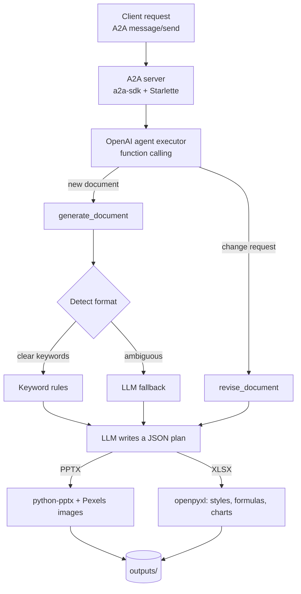

# Agentic Document Generation Pipeline

An AI agent that turns a plain-English request into a finished **PowerPoint deck** or a styled **Excel workbook**, and decides which format fits best on its own.

> "Create a presentation on chocolates" → a slide deck with pictures
> "tracker of nvidea sales" → a multi-sheet Excel workbook with formulas and charts

Built for **Shipathon 2**, where the team placed in the **Top 10 out of 100+ teams**.

---

## Features

- **Automatic format detection.** Keyword rules handle clear requests ("presentation", "slides", "spreadsheet", "tracker", "budget"...). Ambiguous requests fall back to an LLM that decides between PPTX and XLSX.
- **PowerPoint generation** with `python-pptx`: a title slide plus content slides, each with detailed bullet points and a relevant image sourced automatically from the Pexels API.
- **Excel generation** with `openpyxl`:
  - Overview sheet with a title banner, clickable sheet links and a chart dashboard
  - Coloured headers, banded rows, frozen headers and filters
  - Number formatting for currency, percentages, integers and dates
  - Live `SUM` / `AVERAGE` formulas in a totals row
  - Pie, bar and line charts
  - Four colour themes (blue, green, purple, orange)
- **Conversational revision.** Follow-up messages such as "change the theme to purple and add a savings sheet" edit the last document.
- **Agent-to-Agent (A2A) service.** The agent is exposed through the A2A protocol, so any A2A client can call it.
- **Dockerized** for one-command startup.

## How it works



1. The executor sends the user's message to the OpenAI model, which chooses a tool: `generate_document` or `revise_document`.
2. The toolset picks the output format (keyword rules first, LLM for ambiguous requests).
3. The LLM produces a structured **JSON plan** (slides or sheets, columns, rows, chart specs).
4. A renderer turns the plan into a real file in `outputs/`. Values from the model are cleaned first (for example `"13,500"` becomes a number).
5. The file path is returned to the caller.

## Tech stack

Python 3.11 · OpenAI API (GPT-4o) · A2A protocol (`a2a-sdk`) · Starlette / Uvicorn · python-pptx · openpyxl · Pexels API · Docker

## Project structure

```
.
├── src/
│   ├── __main__.py                # A2A server entry point (agent card, routes)
│   ├── openai_agent.py            # System prompt and tool registration
│   ├── openai_agent_executor.py   # OpenAI function-calling loop
│   └── agent_toolset.py           # Format detection, planning, PPTX/XLSX rendering
├── outputs/                       # Generated files appear here (git-ignored)
├── Dockerfile
├── docker-compose.yml
├── requirements.txt
├── pyproject.toml
├── request.json                   # Example A2A request
└── .env.example                   # Template for your API keys
```

## Getting started

### Prerequisites

- [Docker Desktop](https://www.docker.com/products/docker-desktop/) (running)
- An [OpenAI API key](https://platform.openai.com/api-keys) with available credit
- A free [Pexels API key](https://www.pexels.com/api/) (optional, but decks have no images without it)

### 1. Configure your keys

Copy the template and fill in your keys:

```bash
cp .env.example .env
```

```env
OPENAI_API_KEY=sk-your-openai-key
PEXELS_API_KEY=your-pexels-key
```

`.env` is git-ignored. Never commit it.

### 2. Start the agent

```bash
docker compose up --build
```

Wait for `Uvicorn running on http://0.0.0.0:5000`. The agent card is available at
`http://localhost:5000/.well-known/agent-card.json`.

### 3. Send a request

Edit the `"text"` field in `request.json`, then send it.

**Mac / Linux**
```bash
curl -X POST http://localhost:5000/ -H "Content-Type: application/json" -d @request.json
```

**Windows PowerShell** (use `curl.exe`, not `curl`)
```powershell
curl.exe -X POST http://localhost:5000/ -H "Content-Type: application/json" -d "@request.json"
```

Generation can take up to a minute, because the agent makes several LLM calls and a deck also downloads images. The reply includes a `file_path`; the file is in your local `outputs/` folder.

### Running without Docker

```bash
pip install -r requirements.txt
cd src
export OPENAI_API_KEY=sk-...        # PowerShell: $env:OPENAI_API_KEY="sk-..."
export PEXELS_API_KEY=...
python __main__.py --host 0.0.0.0 --port 5000
```

## Example requests

Example `request.json`:

```json
{
  "jsonrpc": "2.0",
  "id": "1",
  "method": "message/send",
  "params": {
    "message": {
      "kind": "message",
      "messageId": "msg-001",
      "contextId": "session-001",
      "role": "user",
      "parts": [{ "kind": "text", "text": "tracker of nvidea sales" }]
    }
  }
}
```

| Prompt | Output | Chosen by |
|---|---|---|
| `Create a presentation on chocolates` | PPTX | Keyword rule |
| `tracker of nvidea sales` | XLSX | Keyword rule |
| `Explain how blockchain works to complete beginners` | PPTX (expected) | LLM fallback |
| `Show monthly revenue and expenses for a bakery` | XLSX (expected) | LLM fallback |

To revise the last document, send another message with the same structure and a change request, for example:

- `Change the theme to purple and add a sheet for regional sales`
- `Make the pie chart on the first sheet a bar chart`
- `Add a slide about risks after slide 6`

## Configuration

| Variable | Required | Purpose |
|---|---|---|
| `OPENAI_API_KEY` | Yes | Planning, tool calling and format detection (GPT-4o) |
| `PEXELS_API_KEY` | No | Slide images. Without it, decks are generated without pictures |

## Limitations

- **Sample data is AI-generated.** Spreadsheet figures are illustrative, not retrieved from real sources. Each workbook includes a note saying so.
- **Revision covers the latest document only,** and is kept in memory. It is lost when the container restarts, and it is shared across all callers, so this is a single-user setup.
- **Revisions regenerate the whole file** from an updated plan. Manual edits you made to a generated file are not carried over, and each revision is saved as a new file.
- **Slide count and content follow the model's output,** so they can vary slightly between runs.
- **`a2a-sdk` is pinned below 1.0.** Version 1.x changed the API this code imports.

## Possible improvements

- Per-session document state (keyed by `contextId`) and persistent storage
- Accepting uploaded data so spreadsheets use real numbers
- Choosing themes, slide counts and chart types explicitly in the request
- Streaming progress updates while a document is generated

